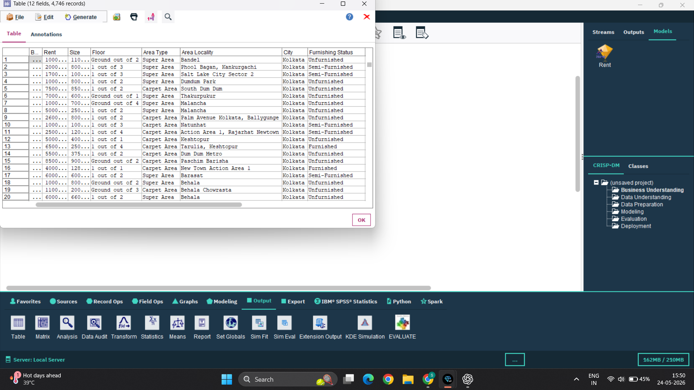
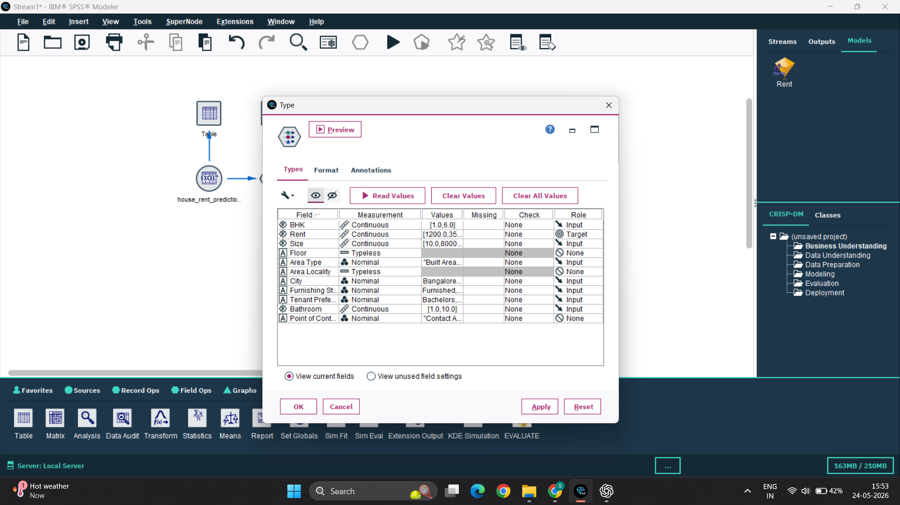
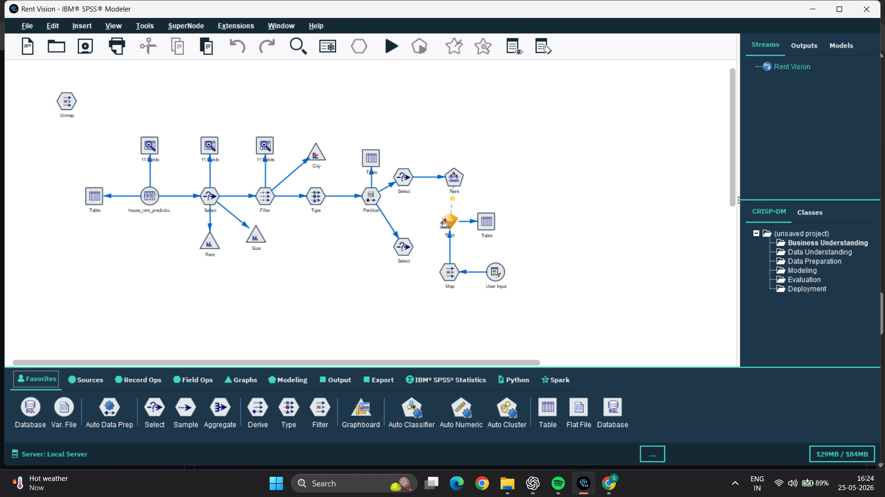
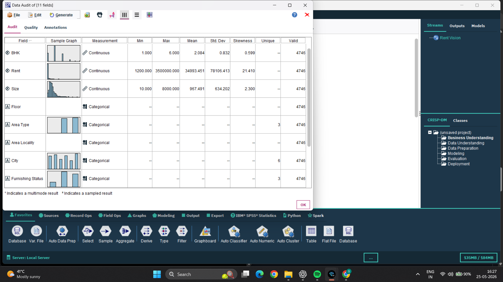
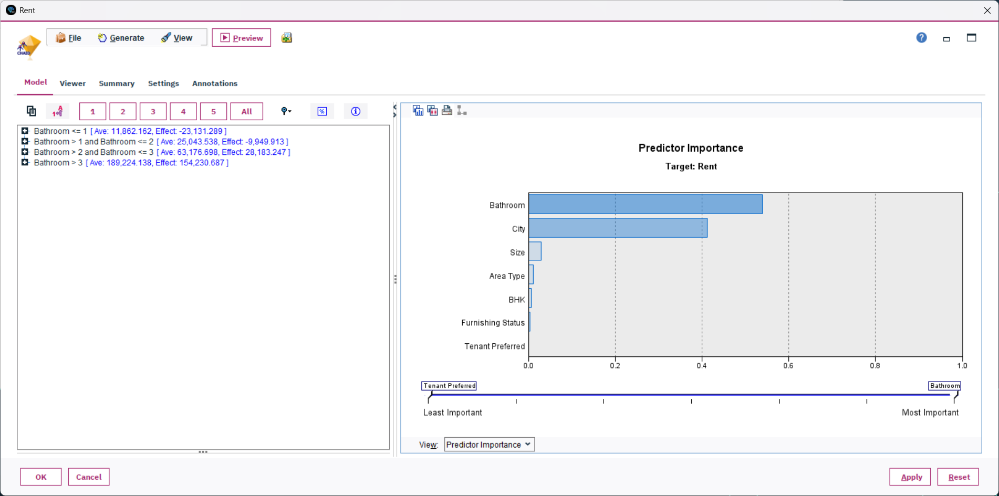
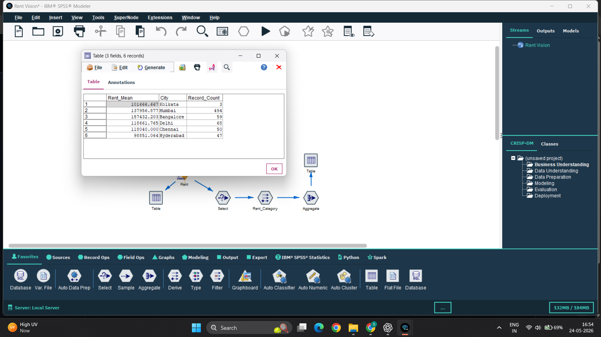

# 🏠 RentVision

Predictive Analytics-Based House Rent Prediction System using IBM SPSS Modeler and CHAID Algorithm.

---

# 📌 Project Overview

RentVision is a predictive analytics project developed using IBM SPSS Modeler and the CHAID algorithm.

The system analyzes housing attributes such as:

- BHK
- Size
- Bathroom Count
- City
- Area Type
- Furnishing Status
- Tenant Preferred

to identify rental trends and generate analytical insights.

---

# 🎯 Objective

The objective of this project is to:

- Analyze historical housing data
- Predict rental trends
- Identify important factors affecting rent
- Generate business analytics insights

---

# 🛠 Technologies Used

| Technology | Purpose |
|---|---|
| IBM SPSS Modeler | Predictive Analytics |
| CHAID Algorithm | Decision Tree Modeling |
| Excel Dataset | Data Source |
| GitHub | Project Hosting |

---

# 📂 Dataset Information

The dataset contains the following attributes:

| Attribute | Description |
|---|---|
| BHK | Number of Bedrooms |
| Rent | Target Variable |
| Size | Property Size |
| Bathroom | Number of Bathrooms |
| City | City Name |
| Area Type | Super Area / Carpet Area |
| Furnishing Status | Furnished / Semi / Unfurnished |
| Tenant Preferred | Preferred Tenant Type |

---

# 📸 Dataset Preview



---

# ⚙️ Type Node Configuration



---

# 🔄 Workflow

```text
Excel Source
      ↓
Type Node
      ↓
CHAID
      ↓
Gold Nugget
      ↓
Select (High Rent)
      ↓
Derive (Rent Category)
      ↓
Aggregate (City-wise Avg Rent)
      ↓
Table
```

---

# 🧠 Full Workflow Screenshot



---

# 📊 Data Audit Analysis



---

# 📈 Predictor Importance Analysis



---

# 🏙 City-wise Rent Analysis



---

# 🔍 Key Findings

The CHAID model identified the following major factors affecting house rent:

1. Bathroom Count
2. City Location
3. Property Size

The project also generated city-wise average rent analysis using aggregate analytics.

---

# ✅ Results

The predictive analytics model was successfully developed using IBM SPSS Modeler.

The CHAID decision tree effectively identified relationships between housing features and rent values.

Business analytics techniques such as filtering, aggregation, and rent categorization were also implemented.

---

# 🏁 Conclusion

This project demonstrates the practical application of predictive analytics in the real estate domain.

Using IBM SPSS Modeler and the CHAID algorithm, the system successfully analyzed rental trends and identified important factors affecting house rent.

---

# 📁 Project Structure

```text
RentVision/
│
├── data/
│   └── house_rent_clean.xlsx
│
├── screenshots/
│   ├── dataset-preview.png
│   ├── type-node-configuration.png
│   ├── data-audit-analysis.png
│   ├── predictor-importance-analysis.png
│   ├── city-wise-rent-analysis.png
│   └── full-stream-workflow.png
│
├── model/
│   └── house_rent_prediction.str
│
└── README.md
```

---

# 👨‍💻 Team Members

| Name | Enrollment Number | Specialization |
|---|---|---|
| Sarthak Bajpai | 24100BTCSFBI17552 | FSDB |
| Sarthak Choudhary | 24100BTCSDSI17485 | DS |
| Noumish Panadiwal | 24100BTCSDSI17479 | DS |
